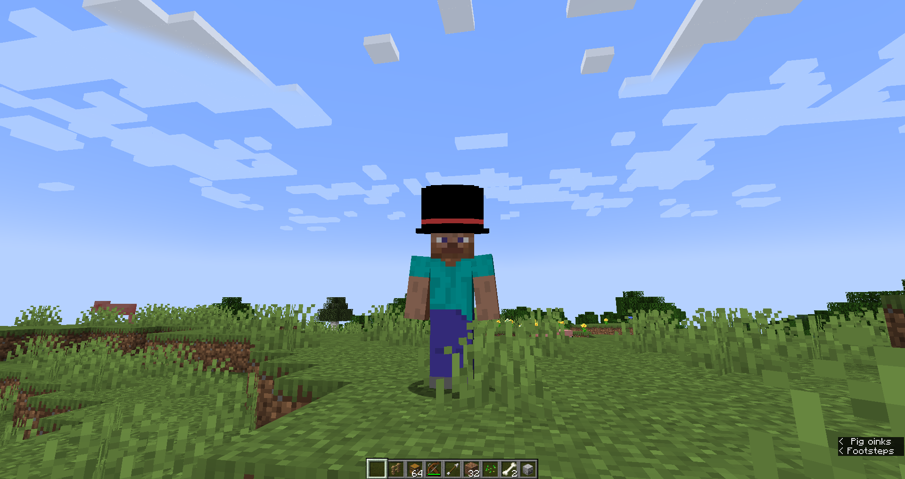
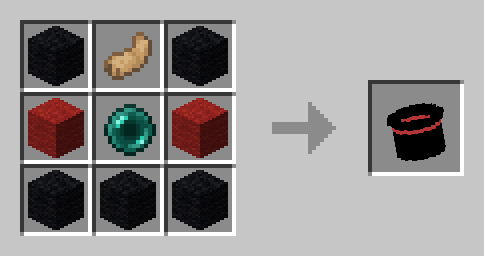

# Mob Hat

Mob Hat is a hat that lets you carry mobs inside it. It's also a very classy hat.

## Picking up mobs

Picking up mobs is very easy! Simply right-click. Right-click again to place them down.

## Crafting recipe

Thanks to destruc7i0n for their [crafting generator](https://crafting.thedestruc7i0n.ca/) used for this image.

## Advancements

This mod adds two advancements&mdash;one for picking up a rabbit with the hat, and another secret one. For all you datapack devs out there, this mod also adds a `mob_hat:mob_hat` advancement trigger with one condition called `entity`, which is an entity condition, the same as `minecraft:summoned_entity`.
